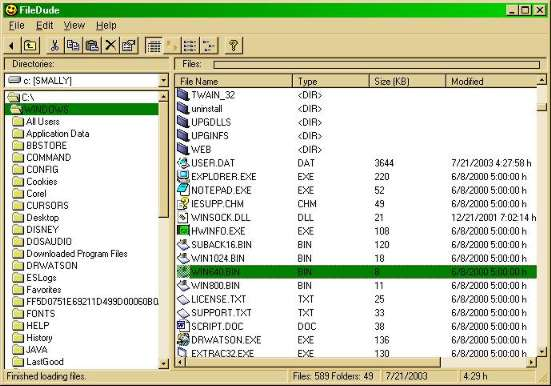



## FileDude \(vb file manager\)

### Description

Simple windows explorer clone, have all the needed functions:

files/dirs copy, move, delete or send them to r. bin.

Oh yea, and rename too :) !

It is very simple, just to show on how to manage files, or create nice

looking file/dirs-view. Pretty easy code...
 
### More Info
 

             |
---                |---
**Submitted On**   |2003-07-24 00:39:42
**By**             |[TheAlas\.com](https://github.com/Planet-Source-Code/PSCIndex/blob/master/ByAuthor/thealas-com.md)
**Level**          |Intermediate
**User Rating**    |4.7 (14 globes from 3 users)
**Compatibility**  |VB 6\.0
**Category**       |[Files/ File Controls/ Input/ Output](https://github.com/Planet-Source-Code/PSCIndex/blob/master/ByCategory/files-file-controls-input-output__1-3.md)
**World**          |[Visual Basic](https://github.com/Planet-Source-Code/PSCIndex/blob/master/ByWorld/visual-basic.md)
**Archive File**   |[FileDude\_\(1645059132003\.zip](https://github.com/Planet-Source-Code/thealas-com-filedude-vb-file-manager__1-48471/archive/master.zip)

